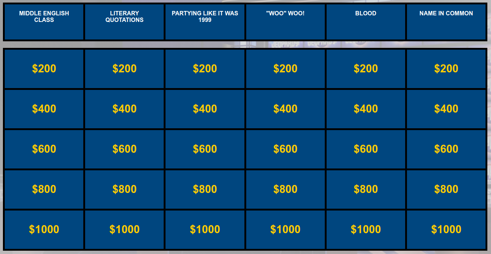
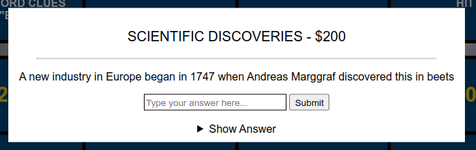

# Web-Jeopardy!

*Jeopardy!* is an American television game show, first airing in 1964.
The objective is to answer as many questions correctly as possible to
increase your earnings. Contestants are presented with questions from
various topics such as history and geography.

*Jeopardy!* consists of six different categories, each containing five
questions and are valued based on their difficulty.

This web-based version of *Jeopardy!* intends to help users test their
knowledge by using an extensive pool of questions, consisting of
**104,669** entries under **12,474** unique categories.

## How to Play

Upon launch, you will be shown a classic-style *Jeopardy!* board:

Each region containing a value is a button and when clicked, you are
presented with a question. Your answer should be typed in the input box
and **is not case-sensitive**. Because this application is supposed to
be used for practice, a *Show Answer* dropdown is included.

If the correct is provided and submitted, the corresponding button turns
green and disabled.

## Data Cleaning / Shaping

Retrieved from:
https://www.reddit.com/r/datasets/comments/1uyd0t/200000_jeopardy_questions_in_a_json_file/

An archive of **216,930** Jeopardy questions with their respective
attributes, spanning back multiple decades.

Originally the dataset consisted of **216,930** entries; however, after
data cleaning, we are left with **104,669**, or ~48%. This is because
of the following criteria:

1. Valid question values are: 200, 400, 600, 800, 1000
2. A category must have at least one question in each of the valid question values
3. Remove questions with links as some are dead

To see more, the `clean_data.py` file is in the `data` directory.

* **Requirement to run**: [pandas](https://pandas.pydata.org/)
